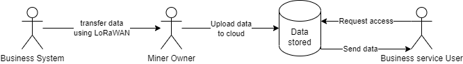

# Introducing Supernodes
The Supernode is a server that all Gateways (M2 Pro Miners) are connected to.

there are multiple Supernodes that servers for different regions.

* EnLink: Korea
* XY Pool: China
* MatchX: Europe
* DU IoT: Asia
* Huobi Pool: America
* Sejong Solutech: Korea
* MXCtest: Test
* MXCbuild: Test
* MXCbuild2: Test 
* MXCbuild3: Test
* MXCChina: Test 
* Wanshi Pool: China 

The Supernode (server) holds users accounts each account is connected minimal to one Miner. User account holds data related to the number of miners connected, the balance of the user and sensor data sent to the miner from external LoRaWAN devices.
The Supernode communicates with the cloud service that is connected to the blockchain in order to reward Users or process transactions.

The Supernode supports many miners throughout the region which creates a network. this network can be used by other LoRaWAN devices and businesses.
all the data transfered by the Business owner is stored in the Supernode server, where it can be accessed by third party users that needs this data.

The Supernode is monitored with Grafana to give a good overview of the load on the server.

