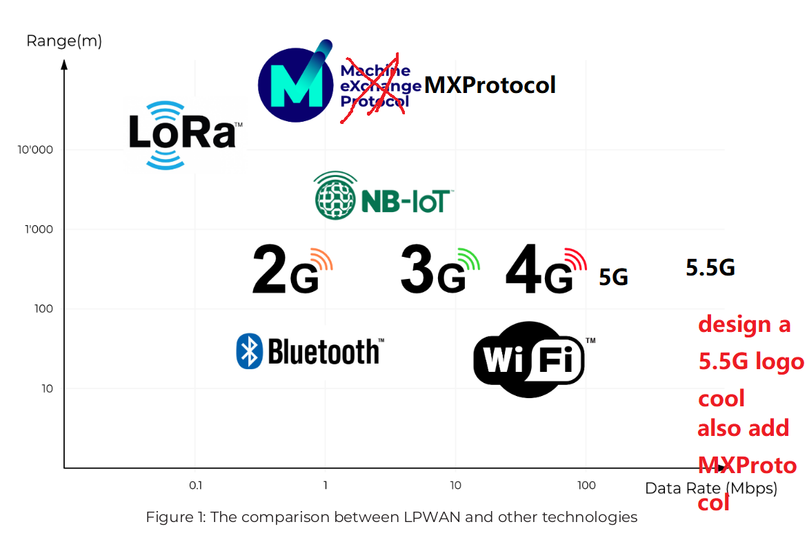
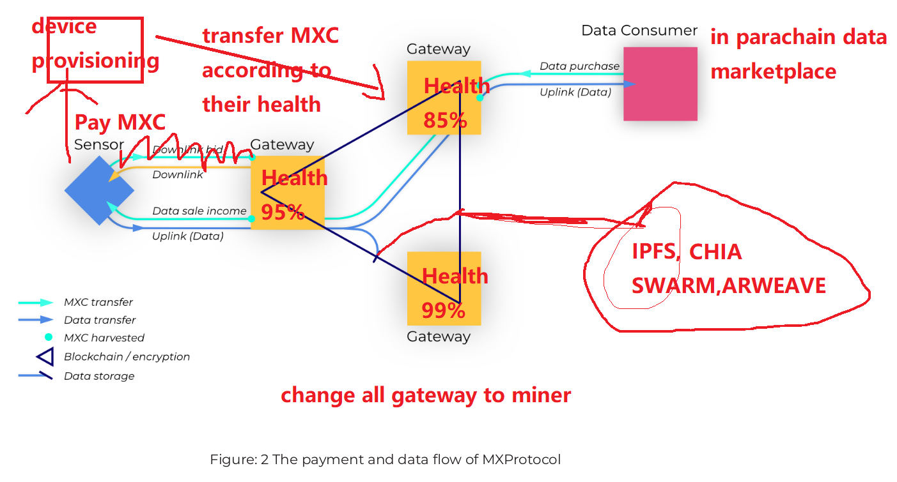
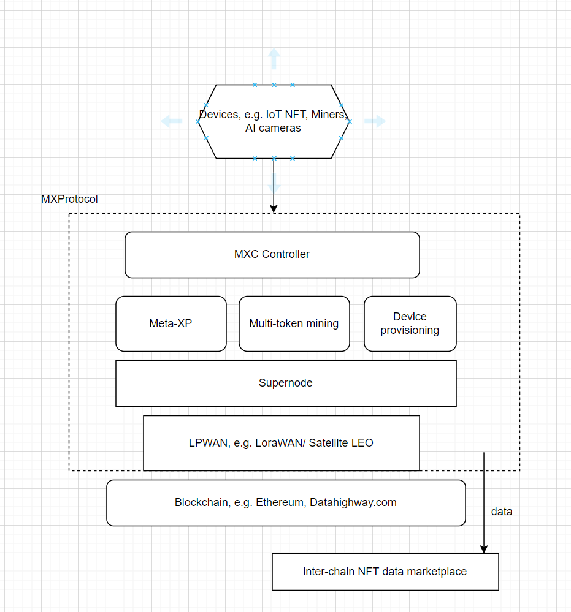
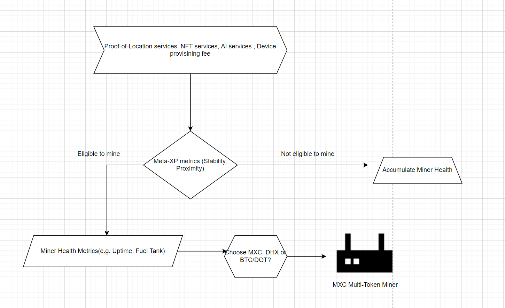
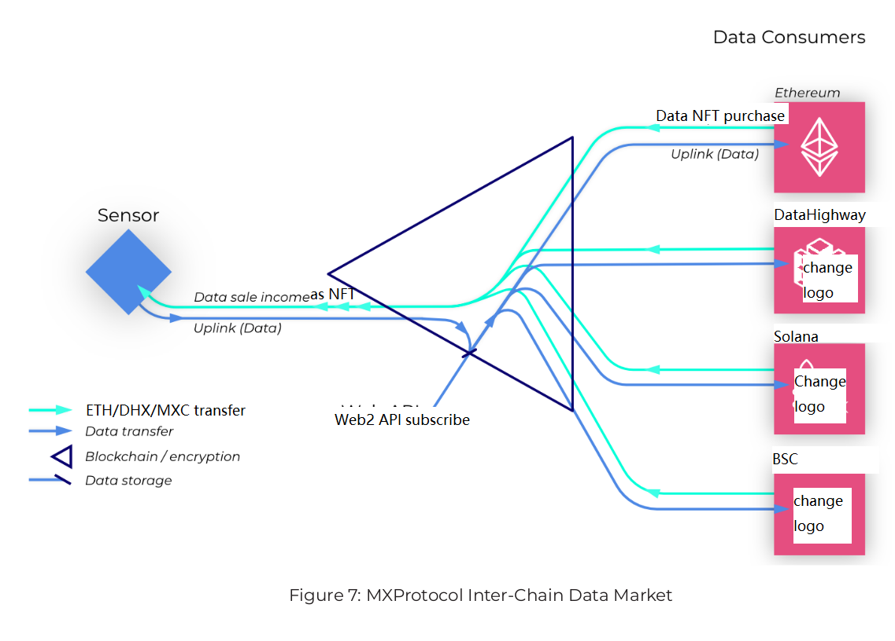
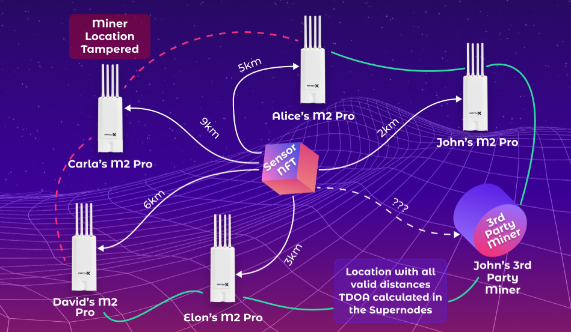

# MXProtocol : Open and Free Network Infrastructure, Secure and Private Data Stream for Web3 & Metaverse

## Table of Contents

- [Meta X Protocol: Open and Free Network Infrastructure, Secure and Private Data Stream for Web3 & Metaverse](#meta-X-protocol-openfree-network-infrastructure-secureprivate-data-stream)
  - [1. MXC Vision](#1-mxc-vision)
  - [2. Background](#2-background)
    - [2.1 LPWAN vs other technologies](#21-lpwan-vs-other-technologies)
      - [2.1.1 LoRaWAN](#211-lorawan)
      - [2.1.2 NB-IoT](#212-nb-iot)
      - [2.1.3 Deployment considerations](#213-deployment-considerations)
    - [2.2 Satellite LEO](#22-5-5g)
      - [2.2.1 Broadband Web3.0 network](#221-broadband)
      - [2.2.2 Deployment considerations](#221-deployment)
  - [MXC economy](#mxc-economy)
    - [3.1 Edge AI platform](#31-edge-ai)
    - [3.2 Blockchain Non-Fungible Token](#32-non-fungible-token)
    - [3.3 Data bloom](#33-data-bloom)
      - [3.3.1 MXC-assisted parking](#331-mxc-assisted-parking)
      - [3.3.2 MXC-assisted IoT NFT](#332-mxc-assisted-iot-nft)
  - [4. MXProtocol stack](#4-mxprotocol-stack)
    - [4.1 Blockchain Supernodes](#41-blockchain-supernode)
      - [4.1.1 Features](#411-features)
      - [4.1.2 Security and efficiency](#412-security-and-efficiency)
      - [4.1.3 Long-term adoptions](#413-long-term-adoptions)
      - [4.1.4 Staking](#413-staking)
  - [5. Proof of Participation](#5-miner-health)
    - [5.1 Goals of design](#51-goals-of-design)
    - [5.2 Design and implementation](#52-design-and-implementation)
    - [5.3 Miner Health metrics](#53-health-metrics)
    - [5.4 Meta-XP](#54-mxp)
  - [6. Multi-token mining](#6-multi-token)
    - [6.1 Goals of the design](#61-goals-of-the-design)
    - [6.2 Design and implementation](#62-design-and-implementation)
    - [6.3 Third party integration](#63-third-party-integration)
  - [7. Inter-Chain Data Market](#7-inter-chain-data-market)
    - [7.1 Goals of the design](#71-goals-of-the-design)
    - [7.2 Design and implementation](#72-design-and-implementation)
    - [7.3 Polkadot parachain](#73-polkadot-parachain)
    - [7.4 Mining Power](#73-mpower)
  - [8. Proof of Location](#8-pol)
    - [8.1 Goals of design](#81-goals-of-design)
    - [8.2 Design and implementation](#82-design-and-implementation)
    - [8.3 MXC Controller](#83-mxc-controller)
  - [9. Development progress](#9-development-progress)
  - [10. References](#10-references)

## 1. MXC Vision

> The MXC vision is to introduce a Web3.0 process to both simplify and
> increase data transactions for AI and blockchain devices.

The decentralized Web3.0 and metaverse infrastructure upon which MXC’s system is based is the future
of Low Power Wide Access Network (LPWAN) and the Meta X Protocol
(MXProtocol). Utilizing this solid device network foundation, MXC is introducing
an extraordinarily unique token, MXC, which
allows for increased data transactions and an idiosyncratic data flow
monetization within the mammoth AI and blockchain markets.

MXProtocol places a keen focus on robust networks,
constructing an inter-chain data market, provisioning devices with lower costs and introducing GDPR-safe AI and blockchain NFT for
both data providers and receivers. For the first time ever, individual network
users, corporations and enterprises can all participate in the construction of
decentralized, ubiquitous and secure LPWAN and LEO-satellite. Simply by connecting “anything” to
the network, adopters will be able to govern and obtain MXC.

The Web3.0 and metaverse network is built on the premise of the “sharing economy.” Therefore,
it is uniquely and exclusively owned by users — both individuals and enterprises
— who take advantage of the monetization of the metaverse in three ways:

1. By increasing coverage authenticate locations via a Miner, e.g. a M2Pro
   LPWAN Gateway Miner, Cisco LPWAN Gateway, or LEO-satellite miner
2. By unleashing access to a massive network
   of published and traded real-world data to the NFT marketplace which is securely traded using
   blockchain technology
3. By owning polygons that created by miners and enable multi-token mining

Both sensors and connected devices joining the network through device provisioning tags to use the unlimited downlinks and uplink resources in MXC LPWAN for free. This ultimately increases LPWAN coverage. "Things" can autonomously access to LPWAN with MXC tokens and get accredited by sharing data or creating unique values on Blockchain, Web3 and Metaverse.

There has been a phenomenal increase in the sourcing, collection and
transmission of big data to blockchain and metaverse within the past few years. Additionally, the
increasing use of AI feeding off this data has assisted
people to simplify tedious tasks and to make better informed decisions online on
everything from projecting a weather forecast, to track a lost pet, to
find the parking lots alongside the street. The tone has now been set for
decades to come. AI and Blockchain devices interacting with one another has seen a significant
increase over such a short period. This will only increase as our
interdependency on Web3.0 and Metaverse and virtual world grows and becomes ever more
significant in day to day life.

Whether for individuals or big companies, the need for a privacy focused web3 and Metaverse network
concentrating on machines-to-machine and human-to-human data is here to stay. It will play a
bigger part in supporting both individuals and businesses than ever before.
MXProtocol introduces the next generation of LPWAN and LEO-satellite with a superior AI and Blockchain data
platform and a premium network experience, allowing for a simplified and
expedited way to create a secure and efficient solution for AI and Blockchain devices in Metaverse.

The following sections elaborate on the unique advantages of MXProtocol,
including its components — Blockchain Supernodes,  Proof-of-Participation,
Multi Token Mining,Inter-Chain Data Market and Proof-of-Location — that make it a truly
innovative design.

## 2. Background

MXC is a Saint Vincent and the Grenadine non-profit organization based in a lot of cities like New York and Berlin. MXC is partnering with various LPWAN and LEO-satellite companies.
MXProtocol is a revolutionary design that solves the problem of LPWAN and
bridges the AI and Blockchain data gap between different Web3.0 infrastructures.

IoT is a hot topic that has been intently discussed for over a decade. The one
focus and premise of the IoT network is connecting “things” to the Internet and
collecting/using this data from the objects that can’t speak for themselves. The
application of this new founded, increased data is highly limited due to the
current methods offering low range and high power consumption. For example,
standard WiFi can generally reach an absolute maximum of around 100 meters, and
using 4G/5G consumes a significant amount of power, thus reducing effective
battery life and increasing maintenance costs significantly. The fact is,
current implementations for data networks are extremely expensive and offer very
low usability. The need for a new technology is here and the need for LPWAN and LEO-satellite will
only increase as it solves the current problems of AI and Blockchain device data
transmissions for Web3 and Metaverse.

In Metaverse, everything needs to be connected from real-world, some of the virtual objects would have a real item to authenticate and encrypt. The needs of bringing offline objects to Metaverse is definitely increasing and the bridge between real world and web3 needs a native blockchain wireless network.

The fact is, current implementations for data networks are extremely expensive
and offer very little coverage for AI and Blokchain devices. The need for a new technology is here and the need
for LPWAN will only increase as it solves the current problems of low range/high
cost, insecure data transmissions for Web3.0 and Metaverse. MXProtocol built with both low-bandwidth and high-bandwidth Web3.0 to offer comprehensive gateways to metaverse.

<figure>
  
</figure>

### 2.1 LPWAN vs other technologies

LPWAN technology emerged to the forefront in recent years with the goal of
finding a better data transmission solution to the shortfalls of WiFi, Bluetooth
and 4G & 5G networks. These earlier established networks were originally
targeted at connecting people, not at connecting the data generated by “things.”
The amount of machine-generated data has multiplied significantly in recent
times. The new LPWAN technology offers aspects where others simply can’t
compete:

- 10 year sensor battery life
- 40 km data reach with just a single Gateway Miner
- Offers an extreme amount of connection points (over 240,000 for a single network
  cell) supported by LPWAN Gateways at an extremely low cost

Now, when compared to the current wireless network, it’s easy to see the
superior advancements that the MXC solutions offer. As illustrated in Figure 1,
LoRa and NB-IoT are simply the most potent solutions on the LPWAN market. While covering local indoor areas, MXC also offers LEO-satellite that all the mobile devices support for transmitting more data.

#### 2.1.1 LoRaWAN

LoRaWAN is an open-source protocol defined by the LoRa Alliance, which is
already supported by industrial giants such as Cisco, Alibaba, Comcast, IBM and
SK Telecom and many more. Advantages of LoRaWAN are 40 km open space coverage,
low data rates (low-level kbps) and ultra-low power, allowing for 10 years
continued operation on a single battery.

Both the Gateways and end sensor devices use the LoRaWAN protocol. In fact,
devices of any brand are supported and can be connected to the network as long
as they are LoRa/LPWAN compatible. MXProtocol is an improved version of LoRaWAN in many ways. All the LoRaWAN devices can easily connect to MXC provisioning server to join the network.

#### 2.1.2 NB-IoT

NB-IoT is a narrowband radio technology specified by 3GPP as a licensed
telecommunication protocol. NB-IoT focuses specifically on indoor coverage,
low throughput and long battery life, enabling a large number of connected
devices.

The advantage for an MXC IoT user is that it gives an individual the power to
host their own network wherever and whenever they like. Compare that with the
NB-IoT base stations (which are owned by telecommunications conglomerates) which
charge users expensive SIM card fees to send data messages over the Internet
through NB-IoT protocol. MXProtocol supports all LPWAN technologies, developed
LoRaWAN Gateways, NB-IoT and LoRaWAN sensors. That’s decentralization. That’s
yet another MXC advantage.

#### 2.1.3 Deployment considerations

When deploying LPWAN, the first consideration is understanding how to avoid a col-
lision between different competing networks residing in the same region. Generally, the
issue comes from the fact that both may use the same channel to send out the message at
the same time and leave the other available channel empty due to the chosen preferences.
As a result, it’s generally hard to reach a consensus between these networks and thus the
deployment suffers as network usage increases. The decentralization and distributed mech-
anism of MXProtocol solves this issue by coordinating the networks via blockchain. The network evolves
by having users pay micro-payments for the services like Proof-of-Location that another one offers.

The second concern is due to the shortage of downlink resources for the dense sensor/
end device deployment. Usually there are some sensors/end devices which require no
downlink or can bear with the loss of downlinks. This is usually associated with low-activity sensors, such as garbage bins or electricity meters. However, end devices like bike
locks or location tracker devices need to receive regular and reliable confirmations from
the cloud for every uplink. Hence, they are willing to pay a premium for this reliability
and a QoS provided by the networks. MXProtocol provides this bidding resource, ensuring
that, for example, a garbage bin sensor won’t take first preference over the vital downlink
resource of something like a bike lock.

Another consideration pertains to the requirements for multi-national cooperations (MNC)
and small to medium enterprises (SME) authenticate the location of their devices using
LPWAN technology. Within LPWAN, both the data stream and Proof-of-Location features
are simplified, easy to read and can be digitally validated from many kilometers away.
This makes the data services a clear necessity for the needs of the LPWAN market of
tomorrow.

With respect to the needs of MNCs or SMEs, it’s likely that such enterprises will wish to
deploy their own LPWAN to cover an entire city or a region for its own specific applica-
tions such as asset tracking (e.g. automobile) or sensor data management. This is a perfect
solution for “Big Business.” LPWAN technology delivers via its long reach ensuring that
sensor/end device uplink packets are securely received as per the protocol design.

This leads to one of the key aspects of the MXProtocol: Making the network open and free while bringing the monetization of data
services to the forefront. Using the MXProtocol, micro-payments within the LPWAN
infrastructure will be traded from third party sensors/end devices, ensuring data with its location is conveniently, correctly and concisely transmitted in a secure manner, whilst being maintained
by the support of Supernodes. The industry has been waiting for a decentralized
and consensus-based mechanism to improve the usability of LPWAN, and MXC is delivering.

MXC has designed this next generation LPWAN infrastructure using MXProtocol in
order to significantly boost the applications of blockchain/metaverse and IoT within the real-world
context.

### 2.2 Satellite LEO
LPWAN contains mostly low data-rate technologies like NB-IoT and LoRa, however MXProtocol supports Satellite LEO (Low Earth Orbit) network that is low power and reaches few kilometers. As a great complementary to the low data-rate technologies, Satellite-LEO acts as a data channel for devices to connect to Metaverse would make the LPWAN much more versatile. Currently it is relatively easier to launch LEO satellite to offer stable broadband internet to public, thanks to partners like Startlink and KLEO, MXC can focuses on ground miner units to receive the satellite in a Web3.0 approach.

#### 2.2.1 Broadband Web3.0 network
The 802.11 ax standards is designed by IEEE committe to facilitate the low power fast throughput of the network, will take users up to and beyond Gigabit throughput while keeping the power consumption as 1/10 of what 5G delivered. MXProtocol integrates Satellite-LEO with 802.11 ax as a part of LPWAN to deliver comprehensive data regimes to wider public and more devices from the ground miner units.

#### 2.2.2 Deployment considerations
As a home device which access your local internet, usually users won't let someone else to access their home network. How to isolate the Satellite-LEO network from user's home network is critical and the user agreements about the data transferred has no business or personal relationship with the device owner is important. Usually Satellite-LEO with antenna dish needs to face the clear sky view, how to use a high-performance antenna to make sure the network is accessible from ground is considered thoroughly by MXProtocol.

## MXC economy

MXC offers a unique and specifically designed decentralized
technological “Open and Free Network” to the global AI and Blockchain economy in Web3 and Metaverse. Data can be shared on a
mass scale whilst ensuring complete end to end privacy. The MXC intends to be distributed
amongst data owners, data receivers and data network hosts, allowing for a facilitated
cross-over from a “commodity” based token into an everyday trading currency in Web3 and Metaverse.

### 3.1 Edge AI platform

MXC is the first Token designed to bridge current commodity-based
trading of cryptocurrency tokens and the device connected global economy. Utilizing the “sharing
economy,” MXC uses this as an axis, allowing large businesses, SMEs and individuals to
collect GPDR/CCPA-safe data from daily scenarios using Edge AI.

MXProtocol builts an Edge AI platform that connects all the devices that equipped with hardware Neural Network capacity to analyze the data patterns, and only send the end results through MXProtocol to users. Thus the GDPR and CCPA are fulfilled when the privacy related patterns like human faces or paces are not pre-trained in the platform. No any personal or privacy data will be collected as they are ignored by the hardware Neural Networks.

Individuals place LoRa-based Edge AI hardware and their LPWAN miner in opportune positions in order to benefit
from their GDPR-safe data and their decentralized LoRaWAN network. Businesses
benefit by using these user-based networks to send the pre-processed Edge AI data, building a new
“sharing economy.” Wallets are stored in the cloud allowing individuals to benefit from
businesses Edge AI processed data via their LPWAN. The tokens are then sent from the device owners that MXProtocol addresses to Supernodes.

MXProtocol gives network participants incentives to use, deploy and trade their Edge AI devices and network
elements. In addition to that, it is a people-owned secure and private network that won’t
suffer from GDPR and CCPA accusations about collecting personal data.

### 3.2 Blockchain Non-Fungible Token

MXC has been highly successful with regards to the design and production of high-end
LPWAN hardware. Using the tokens and sharing economy will allow for a massive influx
of Non-Fungible Token(NFT) amongst individuals and companies, giving better accesses into artworks, agricultural products, luxury items and unique creations. NFT is also a foundation of Metaverse and a lot of Web3 applications.

With MXC, LPWAN NFT adds a completely new way for individuals
and companies to both trade and manage their unique assets. Current methods
see commodities easily being pirated and reproduced to a number of parties without any
of them knowing that the data has potentially already been corrupted, seen and/or shared
amongst potential competitors/untrusted parties. LPWAN NFT makes it possible for corporations
and individuals to track both physical goods and tangible data, ensuring that buyers/
receivers of the goods are the only party who have received the data/physical good, and for
this information to come from a qualified and reliable source.

LPWAN NFT is also a bridge between digital world and real world assets since each item can have its unique identity on blockchains like Ethereum through MXProtocol. This added great usability to the current NFT exchanges that only support digital products.

By applying LPWAN NFT, the individual items is allocated to one dedicated source. In contrast, a
buyer of a tangible paper certificate, for example, has no way of knowing that the same
certificate hasn’t been sold/reproduced and assigned to potentially multiple parties.

### 3.3 Data bloom

MXC is a blockchain-based decentralized AI and Blokchain platform with both narrow band and broad ban is designed to revolutionize three core
functions based around the Web3 and Metaverse industry: Data collection, Data transaction, Data Visualization.

#### 3.3.1 MXC-assisted parking

The future is here. The one constant in everyone’s life from now on will be the data
surrounding all of us. In the past such a statement referred to “people-generated data.”
However, times have changed. “Machine-generated data” is taking over at a phenomenal
rate.

The beauty of machine-based data, when compared with human-based data, is it doesn’t
sleep. Machine-based data is constant and it’s reliability is unmatched when compared with
any people-generated data. MXProtocol brought the unparalleled Edge AI platform that can process the data according to the pre-trained patterns, and protect data privacy since all the data patterns that are not trained will be ignored.

Take, for example, a navigation app like Google Maps or Here Map route people to the street parking. One of their app features is to show how many parking lots will be available at the final destination. The simple act of reporting parking lots may seem like an impossible task,
but it in fact requires planning and partner management: When do cars leave? How
often should the parking management report? How many employees are required to report parking lots across the city? MXC simplifies such tasks using MXProtocol.

Using Edge AI camera situated above the streets and allowing them to analyze parking data in real time and send via a M2Pro miner allows the app to report the street parking lots in real time but never violate GDPR or CCPA regulations. What does this mean for the public?

- Saving fuel: The cars looking for parking will plan the route ahead,
  as opposed to travel around the place to seek for a slot, irrespective of whether the street is full or someone is waiting for a slot.
- Business insights: By collecting useful information about parking like how many brands of cars and how often the cars park, how many people passing by, businesses can gain insights about how the activities and compositions of the neighborhood and plan their products and promotions targeting the neighbors better.
- Reducing traffic congestion: Parking cars are often frustrating for commuters.
  When searching parking lots on the side of the road, they can increase general traffic significantly.
  Being aware of the availability of parking lots in certain areas can reduce the need
  for trucks and allow for smoother traffic flows.

Many of these highlighted aspects make up the chain of events associated with what are
deemed to be “menial tasks” but, as shown, the flow on effect is quite significant. MXProtocol and Edge AI
is ready to solve such issues, allowing for simple tasks to be categorized and ensuring exact
resources are allocated only when needed.

#### 3.3.1 MXC-assisted IoT NFT

Using LoRaWAN tags and Gateways Miners M2Pro can also boost the usability of blockchain NFTs.

Add LPWAN tags on any item like artworks and luxury goods allows individuals to simply build their own
IoT NFT, free from third party firms and networks charging exorbitant costs. IoT NFTs are also blockchain certificates of offline items, that can't be duplicated or eliminated.

The benefits of doing this for an artist is to allow them to issue their own artwork NFT without the need to understand Ethereum, Gas fee and decentralized wallet. Using
LPWAN significantly reduces the costs, especially when compared with the costs of issuing IoT NFT
using a SIM card.

In addition to artworks, luxury products and expensive machines can be made with NFT using LPWAN, increasing
security, traceability and authenticity for users, all at a very low cost compared to current methods.

By bringing such key services, MXC provides transparency and greatly enhances customer
experience. MXC’s mission is to intensify data sharing whilst forging a unity between
those with blockchain and data service needs and those without finance but who have 
access to network integration and distribution, thus eliminating borders, intermediaries
and prejudices.

MXProtocol focuses on three foundational pillars:

- Extend and support the massive AI and Blockchain data economy
- Utilize the decentralized “sharing economy”
- Exchange of assets within the current blockchain economy

MXProtocol connects “things” utilizing a market-based economy, which adds a plethora
of new transmission points allowing more data to be shared, traded, sold and analyzed for
data mining.

Within the new decentralized MXC economy, everyone can profit from the sharing of
data; end to end encryption grants authorized usage of the NFT data; and entire communities can
benefit from using their locations to act as a network facility to transport this data — trading
assets, profiting from the blockchain economy.

## 4. MXProtocol stack

MXProtocol infrastructure consists of both IoT NFT and Edge AI devices, Miner and cloud.
IoT NFT and Edge AI devices collect data from “things,” and send to the cloud via the LPWAN and Satellite-LEO Miner.
This is uniquely designed to specifically be a decentralized solution allowing for everyone to
suit their/the market’s needs. The usability of the hardware has been specifically designed
as a “plug and play” solution, making installation simple without the need for a professional
configuration. It is designed to be easy to set up and easy to share the data economy.

As the flow in [Figure 2](#fig2) demonstrates, LPWAN Miners connect to each other to form
either a decentralized mesh network as a collective cloud or the Internet. The IoT NFT and Edge AI devices
communicate with Miners using LPWAN or Satellite-LEO technology for bi-directional communication.
Notably, the IoT NFT and Edge AI devices are not purely limited to few product. In fact, any LoRaWAN compatible sensors are able to connect to the LPWAN network and
can start sending and receiving messages through our Proof of Location portal by device provisioning design.

Then device provisioning will transfer the MXC from the device payments and distribute the rewards to miners according to their Meta-XP, how long they stay on the network and how well they maintain the devices.

<figure>
  
</figure>

MXProtocol facilitates the data and value flow of the LPWAN. Inside this
ecosystem, each IoT NFT and Edge AI device has a MXC wallet in Supernode assigned to an
individual user. This is required in order to both pay for the network provisioning and
to receive mining from miner health services. The device wallet is stored
in the Supernode server in order to maintain the LPWAN low-power requirements. This is also
due to the fact that the CPU is usually resource-constrained. The same wallet is
used as the miner wallet (also found in a user account and stored in the
Supernode). This wallet will receive MXC tokens from transporting the data from
the Supernode to the devices and assists in paying for the other LPWAN’s resource or
data or relevant services.

Coinciding with the current LPWAN infrastructure protocol, the data link between
the Miner and IoT NFT/Edge AI devices is unregulated. As a result, there would be
no possibility to be rewarded for forwarding data from the sensor to supernode via
the Miner, and ultimately the downlink resource would be free, only being
allocated on a “first come, first served” basis. There is also a possibility to setup bidding mechanism for miners to offer premium services. This design with a proper Miner health metrics such as altitude can distribute the mining outcome much more better than other designs such as monetizing the downlinks or halving. 

Proof of Location is the key functionality of the network as the miners can triangulate an object's location thanks to precise GPS timestamp and the design of the LPWAN chip. It would be very hard to fake a location of the object unless you cheat 51% of the miners by feeding them wrong GPS coordinates. MXC LPWAN infrastructure solves the problem of robustness and the inequality of the network income,
delivering the ultimate user experience to SMEs and MNCs.

<figure>
  
</figure>

[Figure 3](#fig3) shows the detailed technical stack of the MXProtocol infrastructure.
The decentralized and autonomous LPWAN can be built on any permissionless
blockchain, such as Ethereum blockchain or DataHighway.com.

All LPWAN devices and miners are connected to Supernodes that are hosted by global community via MXC Controller. Based on this, the Multi-token mining between LPWANs, Meta-XP and Device Provisioning are introduced to answer the LPWAN deployment considerations
mentioned in the previous chapter [see 2.1.3](#213-deployment-considerations). Inter-chain Data NFT Marketplace is designed to facilitate the data movement between different LPWAN and apps. Anyone can easily build this network for Metaverse and bridge offline world to online world by collecting the data from devices.

### 4.1 Blockchain Supernodes.

There are various kinds of blockchain. Anyone can use cryptographic keys, anyone can be
a node and join the network, and anyone can become a participant to service the network
and seek a validation like Ethereum and DataHighway.com. Participants can walk away from being a node, return if and when they
feel like it and get a full account of all network activity since they left. This is a true decentralization.

In a permissionless blockchain like DataHighway.com, anyone can read the chain, anyone can make
legitimate changes and anyone can write a new block into the chain as long as
they follow the rules. Decisions on a permissionless blockchain are made by the
network participants. The protocol is based on a consensus protocol. The
permissionless blockchain provides a way to reach consensus without relying on a
closed system called Supernode to accurately record financial transactions.

MXC Supernodes are designed as a layer-2 solution for billions of devices to interact with each other, and then book the necessary transactions to the permissionless blockchain.

#### 4.1.1 Features

MXC built MXProtocol as an inclusive platform where all participants are
encouraged to contribute. MXProtocol is a distributed network protocol backed by
monetization of the resources and incentives from enterprises and individuals
based on permissionless blockchain. The permissionless blockchain design makes
MXProtocol efficient and independent: the more people use it, the more robust
the network will be.

The blockchain should have four key properties: decentralized control, low
latency, flexible trust, and asymptotic security. In other words, MXProtocol
should run on a permissionless blockchain that has:

- A true decentralized network.
- It has eliminated mining rewards.
- All transactions get confirmed quickly.
- There is an anti-spam role. There should be a preventive measure against nefarious users flooding the network (a DoS attack).

#### 4.1.2 Security and efficiency

Often, the speed and privacy of a network is the concern for SMEs and MNCs. Public
blockchains, such as Ethereum and Bitcoin, often suffer from big computing slow downs,
practically grinding the systems to a halt, leading to a situation where the whole network
and the 51 percent resources can attack the blocks. There should be a blockchain providing
more privacy and efficiency for businesses and individuals collectively. MXProtocol needs
to be run on a secure and efficient blockchain that can provide the devices with good connectivity.

The MXC-introduced LPWAN application requires further fragmented and discrete
transactions for sensitive data and services in an IoT realm. That is why MXC
continues to develop upon the permissionless blockchain, making MXProtocol more
efficient and more suitable for the needs of LPWAN and IoT applications. 

Anyone can host a supernode, the process is automatic judged by MXC holders. The onboarding of Supernodes consists of following metrics:

- Lock of 6 million MXC
- has a cloud server with at least dual-core CPU, 16GB RAM， 40GB HDD and 10MB network bandwith
- has business and influences in that region

Anyone who fulfills the metrics will need to go to a governance event like referendum to become a MXC supernode to facilitate the data movement.

#### 4.1.3 Long-term adoptions

As previously stated, MXProtocol is a LPWAN platform protocol that brings
efficiency and robustness to the users. For example, the more supernodes in one region is not necessarily bringing more robustness to the network.

 There are, however, still several components inside permissionless blockchain itself that MXProtocol feels necessary to
emphasize. For example, to ensure the long term stability of the LPWAN IoT
projects, continued research is still required with regards to the current data
interface. Real field deployment will need to be conducted in order to properly
satisfy the plethora of data streams connecting from the LPWAN sensors/end
devices and ensure they are routed to the network seamlessly. 

## 5. Proof of Participation

Due to governmental regulations of the LPWAN spectrum, the downlink is a precious
resource that is closely guarded by sensors and end devices. MXProtocol designed Proof of Participation (PoP) as an unique way to encourage the maintenance of the network and downlinks. As these networks are targeted for enterprises and companies, more aspects should be considered in this design.

Decentralized wireless web3.0 network is not like the distributed ledgers, the hardware stays in one place and provides the network resources to the vicinity.
How to encourage the community to put the hardware miner at a favorable spot and to maintain the link resources without turning it off and stack up together, is a big challenge in the whole industry. PoP gives its own answer to the challenge.

### 5.1 Goals of design

To further overcome such industry-wide issues, MXProtocol implements a PoP with Mining Difficulty and Miner health, designed to bring the high level of robustness of the network. Generally public LPWAN deployment is pushed by both
individuals and corporations who do so in order to maintain their reputations in that region. Introducing a PoP mechanism will cause network stability to
multiply due to the fact that users can get more PoP validations with more reputation and vise versa. The purpose of this section is to examine the PoP design that would support a well-functioning LPWAN ecosystem. The goals
of the design are to:

- Allocate network resources adequately
- Allow all sensors/end devices to trust a decentralized network and use it
- Offer network deployments validations, guide a decentralized community to maintain
- Ensure decentralized LPWAN services are robust
- Power the decentralized network with autonomous governance to simplify and resolve any issues

### 5.2 Design and implementation

There are different metrics, ranges and methods relevant to PoP. The
goal is to allocate the MXC validation to the most stable and committed miner. The design and functionality
of the PoP is proposed in [Figure 4](#fig4). Sensors/end devices pay for the services like Proof-of-Location, NFT and AI after they purchased the device provisioning tags. This influx of payment and service fees will need to be distributed to all miners globally depending on the PoP design, and this means that all miners in every corner of the world can enjoy the validation of the network if they maintain this Web3.0 infrastructure.

In the example illustrated in in Figure 4, there are validation results need to be distributed to MXC multi-token miners thanks to the payment of the network services. Meta-XP will check whether some miners are eligible to participate, if not then the miner has to accumulate more Meta-XP in order to see the validation results.
If the validation result is good, the miner can choose what token they like to receive as results.
In MXC case, miners can receive MXC as validation results and participate in the MXC governance like referendum, election of supernodes.

Usually the different kinds of token users choose, like MXC , DHX and BTC, the much more robust network we will see since there are multiple assets staked and bonded.

<figure>
  
</figure>

### 5.3 Miner Health

Sensors and end devices will already be aware of the status of the Gateway in advance in
order to make an appropriate bid for the resources and the services that provided by the
network. To motivate the network administrator to maintain a robust LPWAN, we define
the following metrics of the Gateway to let sensors/end devices to bid for the dynamic
prices:

- Mean time between failures (MTBF)
- Gateway density
- Fuel tank size
- List of services available

The first key parameter used to measure the stability of a Gateway on the network is
determined by measuring the down time. It is recommended that a smaller MTBF be used
than a larger one, because of the QoS that is required for the sensors. Thus, the high QoS
sensors/end devices are willing to pay for the more stable LPWAN Gateways.

Gateway density is a parameter which is expected to motivate network administrators to
deploy more Gateways in the areas that have little to no coverage. As demonstrated, it’s
already clear that sensors will be willing to pay for low Gateway density with higher
prices. Low density means the downlink channels and the services are limited and that the
prices will be high when sensors are competing with each other. Overall, it’s expected that
this metric will push people to expand the network in order to provide better network
access to the LPWAN devices.

Fuel tanks is an innovative design that is similar to Proof of Stake, encouraging the network to fill more tokens to avoid 51% attack and reach a robust consensus mechanism. MXC miner fuel tank is only available to certain brand miners due to the provisioning system design, other brands miners will not have fuel tanks as the stability of the hardware is not guaranteed. 

From time to time, LPWAN will provide a list of services, e.g. firmware upgrades,
GPS-free localization, network configuration optimization. This allows all hardware to be
regularly kept up to date. Sensors and end devices would then choose from the Gateway
bids for services, combined with the MTBF and the fuel tank, total uptime.

There are a more detailed page which detailed miner health design : Link

### 5.4 Meta-XP

To further encourage the crypto users to maintain and build a commercial ready network, MXProtocol introduced Meta-XP design to adjust the difficulty of the mining.
Often we see in Bitcoin and Ethereum design there is an adjustment of mining difficulties depending on how many miners are in the network. MXProcol introduced similar idea but the Meta-XP is a coefficient from 0 to 1 that tells the network if the miner is more experienced in the network, it is encouraged to proceed to multi-token mining from MXC single token mining.
The following are the methods found in the Meta-XP:

- Hexagon density
  - Currently the limit of the hexagon is 10, if there are more than 10 miners , the later joiners will have lower Meta-XP.
- Altitude
  - The network can gain more Meta-XP by increasing the deployment altitude, however this metric is very hard to proof through air pressure or GPS coordinates since they can be easily faked. MXProtocol designed Proof-of-Location that could proof the altitude is not tampered.
- Total uptime accumulated
  - Meta-XP measures the stability of the miner by how long it stays on the network, since the longer it stays on the network , the more robust the network would be. Blockchain should encourage miners to use the fuel tank filled to mine multiple tokens like DHX or BTC to future increase the network stability.

## 6. Multi-token mining

With the increasing amount of LPWAN field deployments, the problem of network
congestion is anticipated to rapidly increase. This is especially so when the
network coverage targets ultra-long ranges of 20 km or more.

In 2020, there are expected to be more than 75 billion devices connected to the
Internet. If the majority of these are to use LPWAN, it can be assumed that it
would put quite a strain on the network resources. As a result, MXProtocol
infrastructure has bridged the gap between different networks using the
innovative protocol.

### 6.1 Goals of the design

> The MXProtocol also offers a
> general overwhelming consensus
> for all public LPWAN by adding a
> community-based consensus, permissions and deployment permission etiquette.

Here we define the goals of the design for the LPWAN ecosystem:

- Minimize packet collision for uplinks in the same region deployed with multiple
  networks.
- Allocate new resources to the sensors/end devices that need downlink for the networks.
- Enable individual networks to pay for other networks resources and services, i.e.
  network roaming.
- Settle all monetary transactions in MXC.

### 6.2 Design and implementation

The design of the Anti-Collision Coordinator is illustrated in [Figure 5](#fig5). The coordinator
has two responsibilities. The first is to make payments between networks using MXC. The
second is to coordinate between networks about the downlink and uplink status.
In the example illustrated in [Figure 5](#fig5), we see the door lock has successfully bid the downlink
from the MXProtocol at downlink channel 1. However, the network that deployed over 1
km is also using the downlink channel 1 for the garbage sensor, and the pending collision is
obvious. The solution would be that the Anti-Collision.

<figure>
  
</figure>

Coordinator would pay for Cisco’s network resource, allowing the Gateway to pause
downlink channel 1 for this time’s message, thus allowing the door lock to receive the
“unlock door” confirmation from the cloud.

On the other side, the two networks report each other’s uplink lost message, since the
LoRaWAN protocol has the counter for the uplink. Later, the coordinator finds out that
the majority of the packets that are lost come from both street lighting and the parking
meter due to the fact that their sending intervals are overlapped and they are quite close to
each other.

The coordinator then delays the street light’s sending interval or, alternatively, it changes
the data rate to make sure that they won’t collide with each other, and the fees for a delay
should be paid by the parking meter. Such network coordination is expected to occur
quite often when future deployment of LPWAN sensors becomes more dense. Thus,
the Anti-Collision Coordinator solves the problem of the network resource allocation in
free-licensed bands completely.

### 6.3 Third party integration

The Anti-Collision Coordinator is indeed a protocol plug-in for the LoRaWAN server to
control the Media Access Control (MAC) layer of LoRaWAN uplinks and downlinks.

There are two ways to integrate the Anti-Collision Coordinator into the LPWAN server.
First is to run the full node which integrates the anti-collision mechanism into the protocol
layer like illustrated in [Figure 3](#fig3). Another solution is to run a light node with the
anti-collision module that could be compatible with all the LoRaWAN servers.

As [Figure 6](#fig6) shows, the Anti-Collision Coordinator is essentially a plug-in for the other
LoRaWAN servers that is compatible with LoRaWAN protocol. The plug-in is a protocol enhancement that controls the uplink and downlink based on the payment logic and
resource requirement between two or more networks.

A light node connects to the full node to assign the LPWAN a wallet for sending and
receiving MXCs. The Anti-Collision Coordinator controls the MAC layer for all the
LoRaWAN devices. A separate white paper will be released about the protocol design of
the Anti-Collision Coordinator and its APIs for LoRaWAN servers.

<figure>
  
</figure>

## 7. Inter-Chain Data Market

Currently, there are several traditional data markets that originate from
cryptocurrencies, e.g. Streamr, IOTA and Mobius. All provide a secure mechanism
to make sure that the data stream can be copied and transmitted from the owner
to the consumer in a sequential manner.

Most cryptocurrencies are in need of data. This data is fed into the system to
provide checks and balances, ensuring all players along the chain have performed
their role correctly. For example, a smart contract specifies which goods need
to be delivered from city A to city B and this requires the buyer to pay the
seller, e.g. 10 ETH. So, how can one determine whether the goods have been
successfully delivered? The smart contract must rely on external Oracles from
either the GPS data from the package or the LPWAN tag reading from the
warehouse.

> The entire industry continually requires chains such as Mobius or MXC to feed
> other chains smart contracts and the interdependent information to the
> applications.

Oracles are third party services which are not part of the blockchain consensus
mechanism. The main challenge with Oracles is that people need to trust these
sources of information. Whether a website or a sensor, the source of information
needs to be consistently trustworthy. In order to solve these issues, Oracles
have different trusted computing techniques.

### 7.1 Goals of the design

Blockchains support Oracles in order to assist with fetching external data. The
reason for this comes from the fact that blockchain applications, such as
Bitcoin scripts and smart contracts cannot access and fetch data directly. As a
result, they require pricing feeds for assets and financial applications and
weather-related information for peer-to-peer insurance, all written with smart
contracts. Here we define the goals of the MXProtocol data market with respect
to designing for Oracles:

- Facilitate data usage between different blockchains
- Establish a trusted resource for the external Oracles
- Stack up the data for later purchase
- Enable purchase of a live data stream
- Provide APIs for non-blockchain applications to access the data
- Settle all monetary transfers within MXC

### 7.2 Design and implementation

The MXProtocol Inter-Chain Data Market provides an effective method to feed the
other smart contracts with LPWAN data captured by sensors or end devices.

<figure>
  
</figure>

[Figure 7](#fig7) shows the example of the transaction between MXProtocol data and blockchains
like Ethereum.

MXProtocol feeds data to Ethereum smart contracts, and gets Ethereum payments as
rewards. It only requires a simple protocol to trust that the data fetched from
the MXProtocol data source is genuine and untampered. In addition to that, the
rich data stream can also be used by external non-blockchain applications via
Web APIs.

Major block chains like Ethereum are short in data for smart contracts, and the data that
is provided by external Oracles essentially may not be trustworthy. With the MXProtocol
Inter-chain data market, the generation and flow of the data can be tracked and verified
publicly on the chain. Hence, the security issue is solved internally with MXProtocol.

### 7.3 Polkadot and Aeternity

Polkadot is essentially a protocol that communicates between different networks.
It solves consensus and transaction delivery between different chains.

Aeternity is created to be the interface between real world data and smart
contracts. Instead of using Oracles that can cause a single point of failure,
Aeternity’s design provides decen- tralized infrastructure for holding and
transferring the data to smart contracts.

The MXProtocol Inter-chain data market uses the idea and mechanism developed by
both Polkadot and Aeternity to deal with consensus, privacy, transaction
delivery and security. A separate white paper will be released about this
design.

## 8. Smart Bidding use cases

### 8.1 Downlink resource auction

Downlink resource auctions occur when it is the only option for the Gateways to
decide which sensor/end devices to communicate with. The Gateway usually has
eight downlink channels, supporting more than 60,000 sensors that need to be
acknowledged in sequence. Uplinks are free for the sensors since all the
Gateways will pick up the packets and forward them within the same network, and
the Anti-Collision Coordinator needs to pay the other network when collisions
need to be avoided. The downlink resources need to be allocated to some sensors
that need downlinks to execute the commands ([See Figure 8](#fig8)). Smart Bidding codes
decide the willingness for the sensor/end devices to pay for the resources, and
all the transactions are settled in MXC.

Both the European and U.S. radio committees impose regulations on the spectrum
access for LPWAN radios using 868/915Mhz bands. These regulations cover issues
from maximum time on air to maximum duty cycle, which, in turn, introduces
waiting times between two packets. For Gateways without Listen-Before-Talk
Technology, this waiting time can range anywhere from a few milliseconds to
minutes depending on the data rate and number of bytes being sent.

<figure>
  
</figure>

Currently, the downlink resource is distributed on a “first come first served”
basis, which can lead to many potential problems for various devices. For
example, if an electricity monitoring meter were to get downlink priority over a
door lock, the door lock in turn doesn’t receive the confirmation to unlock the
door. The MXProtocol Smart Bidding solves this problem as covered in the
following two aspects:

- Allocate the downlink resource within the same LPWAN using the Smart Bidding
  code snippet for the auction.
- Enable different networks to trade for the downlink resources for the sensors/
  end devices that are willing to pay.

The snippet of code inside the sensors/end devices decides the market prices of the
LPWAN. For a dense Gateway deployment like a city center, the prices can be lower due to
the abundant resources of the downlink channels available. While in the mountains or suburban areas, few sensors would compete for the downlink
resources and thus the prices will rise. The sensors will bid according to the MTBF,
downlink numbers and the density of the network.

The auction method and logic behind the bidding can be programmed by the owner of the
sensor. It is expected that AI-driven algorithms will later be introduced to offer smarter
bidding strategy for the sensors and end devices.

### 8.2 Network coverage market

It is expected that the supply of downlink resources will gradually increase
with the demand of the sensors/end devices. The bidders will pay for the high
prices for the lower Gateway density, which gives SMEs and MNCs incentives to
expand the network coverage to get more MXC coin rewards.

Figure 6 illustrates the market placed by Smart Bidding codes. The prices are
lower at the dense deployment where the two LPWAN coverages overlap, and higher
where there is only one LPWAN coverage.

Some sensors travel around the city. Their code specifies the maximum amount of
coins that it would like to pay for a single downlink. However, they have been
to the places where no LPWAN coverage is available. Once they are back to the
network, they put the last off-chain bid to the chain, and notify the whole
network that they are willing to pay a pre-determined price from the Smart
Bidding code.

The prices and the amount of off-chain bids will surely motivate companies and
individuals to deploy the LPWAN Gateway to the field, thus expanding the network
coverage for the chain. MXProtocol shifts control from telecommunication
conglomerates to companies and individuals by allowing them to deploy their own
LPWAN.

### 8.3 Service market

There are lists of services that LPWAN can provide to the sensors/end devices.
For example, an Over-the-air firmware update should be multi-casted to the
sensors with downlink and it requires the sensors to bid for the resource.

The most attractive aspect of the LPWAN is to implement GPS-free localization,
which also works indoors and underground. In contrast to GPS or SIM card’s high
power consumption and limited reach, LPWAN localization uses the packets sent
by the sensors to calculate the position, which requires no computation from the
resource-limited sensors.

Such a service requires the resources of both a Gateway and the cloud. Hence, the Smart
Bidding code will specify whether it is willing to pay for the service and its accuracy. The
more Gateways that receive the packets, the more accurate the position will be.

LPWAN sometimes needs to change the channel configurations like the arrangement
or the allowed data rate. This kind of coordination will need to be applied globally and the
network will have to try to synchronize such a configuration as much as possible. Smart
Bidding can also accept “free auctions” where they require no one to pay.

Through the MXProtocol Smart Bidding design, it is possible that sensors/end devices pay
for the services that the network offers to them. The outcome of the design will be:

- Some sensors/end devices get the services and the resources that they demand
  through auction
- Network deployment receives reward by offering services and resources to the
  LPWAN sensors/end devices
- All the monetary transactions are done automatically in MXC without human intervention

## 9. Development progress

MXC Foundation’s partner MatchX has released the MatchBox LPWAN Gateway, and
the LPWAN module with development kits. It has reached more than 40 countries with
distributors in Australia, North America, Asia and Europe.

The first Proof-of-Concept has been performed in conjunction with the Stellar
Development Foundation, utilizing the LPWAN coverage and enabling sensors to pay
with each other.

## 10. References

- _What is LPWAN (low-power wide area network)?_ - Definition from WhatIs.com.
  (2018). IoT Agenda. Retrieved 8 January 2018, from <http://internetofthingsagenda.techtarget.com/definition/LPWAN-low-power-wide-area-network>
- _LoRa Alliance._ (2018). LoRa Alliance. Retrieved 8 January 2018, from <https://www.lora-alliance.org/>
- _Skywire and Viscript | Skycoin Blog._ (2018). Blog.skycoin.net. Retrieved 8 January
  2018, from <https://blog.skycoin.net/skywire/skywire-and-viscript/>
- _Skywire - Skycoin Meshnet Project | Skycoin Blog._ (2018). Blog.skycoin.net. Retrieved
  8 January 2018, from <https://blog.skycoin.net/overview/skywire---skycoin-mesh-net-project/>
- _contributors, S._ (2018). Create an Account | Stellar Developers. Stellar.org. Retrieved
  5 February 2018, from <https://www.stellar.org/developers/guides/get-started/create-account.html>
- Kusmierz, B. (2017). _The first glance at the simulation of the Tangle: discrete model._
- Popov, S. (2016). _The tangle._ IOTA.
- Kim, J. (2014). _Introducing Stellar - Stellar CN._ Stellar CN. Retrieved 5 February
  2018, from <https://www.stellar.org/cn/blog/introducing-stellar>
- _Ethereum Project._ (2018). Ethereum.org. Retrieved 8 January 2018, from <https://
  www.ethereum.org/?
- _Blockapps Developer Edition._ (2018). Developers.blockapps.net. Retrieved 8 January
  2018, from <https://developers.blockapps.net/>
- _RSK._ (2018). RSK. Retrieved 8 January 2018, from <https://www.rsk.co/>
- Dudley, J., Hochstetler, G., Dudley, J., Hearn, M., Hearn, M., \& Hearn, M. (2018).
  _Corda: Frictionless Commerce._ corda.net. Retrieved 8 January 2018, from <https://www.corda.net/>
- _LoRaWAN in Europe._ (2017). Matchx.io. Retrieved 8 January 2018, from <https://matchx.io/community/eu/12-lorawan-in-europe>
- _LoRaWAN regulations in Korea, Australia, India Japan and South East Asia._ (2017).
  Matchx.io. Retrieved 8 January 2018, from <https://matchx.io/community/world/13-lorawan-regulations-in-korea-australia-india-japan-and-south-east-asia>
